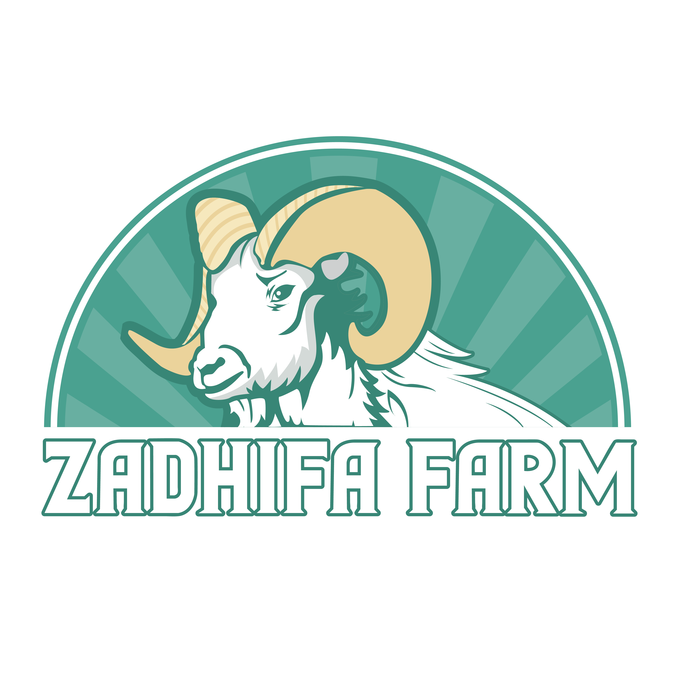

# Zadhifa Farm - Premium AgTech SaaS Platform



## Overview
Zadhifa Farm is a high-end, AI-driven SaaS platform designed to bridge the gap between traditional livestock farming and modern digital commerce. It features a "Neo-Agrarian" aesthetic, real-time IoT monitoring, and AI-powered recommendation systems.

## Features

### 🛒 AI Personal Shopper
- **Smart Matching:** Finds the perfect livestock based on budget, purpose (Qurban/Aqiqah), and event date.
- **Scoring Algorithm:** Calculates a 0-100% match score based on multiple weighted factors.

### 📡 Live Farm Intelligence
- **IoT Simulation:** Real-time visualization of temperature, humidity, and air quality in pens.
- **Alert System:** Automatic warnings for suboptimal conditions.

### 🧬 Digital Twin Provenance
- **QR Code Integration:** Every goat has a unique digital profile.
- **Immutable History:** Tracks lineage/pedigree, vaccination records, and growth history.

### 📊 Admin Command Center
- **Growth Analytics:** Visual charts tracking weight gain vs. AI projections.
- **Inventory Management:** Detailed tracking of herd health and location.
- **Predictive Pricing:** AI forecasting for seasonal market spikes (e.g., Idul Adha).

## Tech Stack
- **Framework:** Next.js 14 (App Router)
- **Styling:** Tailwind CSS + Custom "Neo-Agrarian" Token System
- **Animations:** Framer Motion
- **Database:** Prisma ORM (PostgreSQL ready)
- **Visualization:** Recharts

## Getting Started

1. **Install Dependencies**
   ```bash
   npm install
   ```

2. **Run Development Server**
   ```bash
   npm run dev
   ```
   Open [http://localhost:3000](http://localhost:3000) to view the Landing Page.
   Open [http://localhost:3000/dashboard](http://localhost:3000/dashboard) to view the Admin Dashboard.

3. **Database Setup (Optional)**
   Connect your database in `.env` and run:
   ```bash
   npx prisma db push
   ```

## Project Structure
```
zadhifa-farm/
├── app/                  # Next.js App Router pages
├── components/           # React components
│   ├── landing/          # Landing page specific components
│   ├── dashboard/        # Admin dashboard widgets
│   └── ui/               # Reusable UI elements
├── lib/
│   └── ai/               # AI Logic modules (Pricing, Recommendations)
└── prisma/               # Database schema
```

## License
Private Property of Zadhifa Farm.
